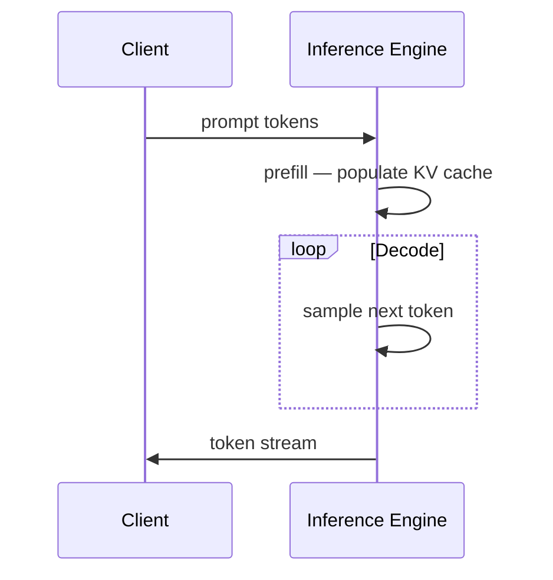

There's a gap that most people never look at.

You type a prompt, hit enter, and tokens start streaming back. If the model is good, you're satisfied. If it's slow, you're frustrated. But almost nobody thinks about what's actually happening between those two moments — the prompt going in and the text coming out.

I watched [this video on LLM inference engines](https://youtu.be/B18zBnjZKmc) and realised I had no concrete mental model for any of it. I knew models had weights, I knew something sampled tokens — and that was about the extent of it. So I built something to make it tangible: a small app that wires up a local model and surfaces the numbers as they happen. This post covers what I learned. The app itself is on the [project page](/projects/llm-inference-explorer).

Three numbers matter for inference performance, and everything else is downstream of them:

- **Tokens per second (tps)** — throughput. How fast the model can generate text once it's going.
- **Time to first token (TTFT)** — the latency you actually *feel* before anything appears on screen.
- **Inter-token latency (ITL)** — the gap between each token during streaming. What determines how smooth the output feels.

The piece of infrastructure responsible for all three is the **inference engine**.

---

## ⚙️ The Two-Phase Execution Model

LLM inference doesn't run in one continuous pass. There are two distinct phases with very different computational profiles, and understanding the split is the conceptual key to everything else.

### Phase 1 — Prefill

When you submit a prompt, the model processes every token in your input **simultaneously**, in parallel. This is the prefill phase. All tokens are read at once, the attention computation runs across the full sequence, and the results are stored in the KV cache.

The cost of prefill scales with prompt length. A 10-token prompt prefills nearly instantly. A 2,000-token context takes noticeably longer. This is why TTFT goes up when you give the model more context — you're not waiting for generation yet, you're waiting for the model to process everything you sent.

### Phase 2 — Decode

Once prefill is done, the model enters the decode loop. It generates **one token at a time**, autoregressively — each new token is fed back in as input for the next step, and the loop continues until the model produces an end-of-sequence token or hits your max token limit.

This is the part you watch stream in. The per-step time here is your inter-token latency. Tokens-per-second is just its inverse.

### The KV Cache

During the attention computation — which runs on every step — the model calculates key and value matrices for every token in the current sequence. Without caching, it would recalculate all of these on every single decode step. That would be catastrophically slow.

The KV cache stores these matrices once they're computed (during prefill, and for each new token generated) so they don't need to be recomputed. On a device with a GPU or unified memory, the KV cache lives in VRAM. It grows with context length, which is why very long generations start to strain memory.

The phases map directly back to the metrics:

| Metric | What it reflects |
| :--- | :--- |
| TTFT | Prefill cost — scales with prompt length |
| Tokens/sec | Decode throughput — how fast the loop runs |
| ITL | Per-step decode time — what determines streaming smoothness |



---

## 🏗️ llama.cpp vs vLLM: Two Different Philosophies

These two engines come up constantly when you read about LLM inference. They're not competing for the same use case — they solve the problem at opposite ends of the hardware and concurrency spectrum.

### llama.cpp

Written in C++ with minimal dependencies, llama.cpp is designed to run on hardware you actually own. It loads models in **GGUF format**, where the weights are quantized — 4-bit (Q4), 8-bit (Q8), and variants — so a multi-billion parameter model that would need tens of gigabytes at full precision fits comfortably in a few gigabytes of RAM.

On Apple Silicon, llama.cpp uses Metal for GPU acceleration. The unified memory architecture on an M-series chip means CPU and GPU share the same physical memory pool, so there's no data-copy bottleneck between host and device. A quantized 3B model with all layers offloaded to Metal can hit 50+ tokens/sec — fast enough to feel instant in any interactive use.

The design is single-user optimised. Sequential decode, one request at a time. That's a fine trade-off for local use. It's not what you want if you're serving hundreds of concurrent users.

**Best for:** local development, experimentation, edge devices, offline use.

### vLLM

Python-first, NVIDIA CUDA-dependent, production-serving focused. The key innovation is **PagedAttention**: it treats the KV cache like virtual memory, allocating it in fixed-size pages rather than a single contiguous block. This reduces fragmentation and lets the engine serve many concurrent users efficiently — a long generation from one user doesn't hold a solid slab of GPU memory that could otherwise be partially reallocated to shorter requests.

Combined with **continuous batching** — which slots new requests into an in-progress batch as soon as a slot frees up rather than waiting for the entire batch to complete — vLLM sustains high throughput across many simultaneous users in a way llama.cpp isn't designed for.

On an M3 MacBook Pro: not the right tool. No CUDA. Docker on macOS runs inside a Linux VM with no path to Metal, so vLLM would fall back to CPU-only inference and run far slower than llama.cpp natively.

**Best for:** multi-user APIs, cloud deployments, high-throughput serving.

### The Decision Tree

The constraint isn't preference — it's hardware and concurrency requirements.

```
Building locally, one user, learning?  → llama.cpp (via Ollama)
Serving an API to real users at scale? → vLLM (on a GPU server)
```

---

## 📦 Where Ollama Fits In

Ollama is a developer-friendly layer on top of llama.cpp. When you run a model via Ollama, llama.cpp is doing the actual matrix multiplication — Ollama adds process management, model storage, and a REST API on top.

What it adds:

- **Model management** — `ollama pull`, `ollama list`, `ollama rm`. Models are stored as content-addressed blobs under `~/.ollama/models/` and only re-downloaded if the content hash changes.
- **An OpenAI-compatible REST API** on `:11434` — `POST /api/generate` and `POST /api/chat`, both with SSE streaming support.
- **Automatic Metal detection** on Apple Silicon — no configuration needed.

Think of it like a database server: it runs as a background process, your application talks to it over HTTP, and it handles the compute. You don't invoke llama.cpp directly any more than you'd call Postgres binaries directly from application code.

One thing worth calling out explicitly because it catches people: **on macOS, install Ollama natively via Homebrew — not via Docker.** Docker Desktop on macOS runs inside a Linux VM. That VM has no path to the Apple Metal GPU. Inference falls back to CPU-only, and the throughput difference isn't marginal. This is a real gotcha.

```bash
brew install ollama
brew services start ollama   # runs at login, always available
```

---

## 💭 Closing Thoughts

The thing that stuck with me after building the app was how concrete the prefill/decode split became once I could watch the numbers live. TTFT stopped being an abstract SLA metric — it became the wall clock time between "the model starts reading your prompt" and "the model starts generating." When you have a short prompt, TTFT is nearly instant. When you have a long context, you feel the prefill.

The benchmark numbers gave me intuition I didn't have from reading alone — for how model size and quantization trade off against speed, and what "warm" vs "cold" inference actually looks like in practice. All of that is on the [project page](/projects/llm-inference-explorer), including the benchmark results and what the first cold-start run revealed. The next thing I want to do is run the same benchmark against vLLM on a cloud GPU — the numbers will tell a different story at scale, and I expect that comparison will be its own post.
