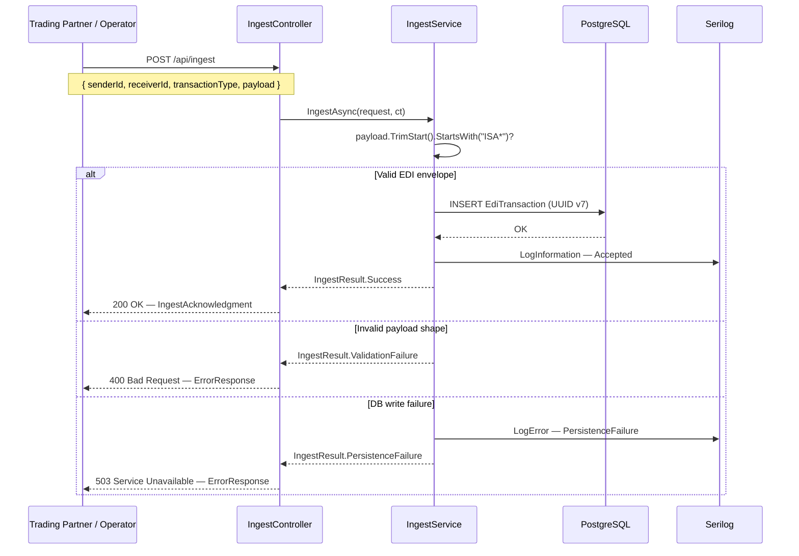

EdiTrack is an EDI X12 transaction ingest platform. It accepts raw EDI payloads from integration
operators and upstream systems, durably stores each accepted transaction, and returns a structured
acknowledgment with a stable transaction ID and correlation ID — making every ingest attempt fully
traceable through structured logs.

## 📋 The Business Problem

Electronic Data Interchange (EDI) is the language large enterprises use to exchange structured
business documents — purchase orders, invoices, ship notices, and healthcare claims. The **X12
standard**, maintained by [ASC X12](https://x12.org/), is the dominant format in North America and
sits at the center of almost every large-scale supply chain, healthcare network, and logistics
operation on the continent.

A few of the transaction sets you encounter in the wild:

| Transaction Set | Document Type |
| :--- | :--- |
| **850** | Purchase Order |
| **856** | Advance Ship Notice / Manifest |
| **810** | Invoice |
| **837** | Healthcare Claim |
| **270 / 271** | Eligibility Inquiry & Response |
| **997** | Functional Acknowledgment |

### Why Ingest Is an Enterprise-Scale Problem

At production scale, EDI X12 is not optional — it is a **contractual requirement**. Large retailers
mandate that suppliers transmit an 850 before shipping goods. Healthcare clearinghouses process 837s
by the millions per day. Every interchange is wrapped in an `ISA*` envelope that encodes sender and
receiver IDs, interchange control numbers, version identifiers, and delimiters — and every one of
them has to land somewhere reliably.

The ingest layer is deceptively hard to get right:

- Payloads arrive from many trading partners with different sender/receiver configurations
- Each accepted transaction must be **durably persisted** and **acknowledged** with a stable,
  traceable identifier
- Every ingest attempt — accepted or rejected — must produce an audit trail
- Failures must return structured, retryable error responses, not silent drops or generic 500s

At enterprise scale this is the domain of dedicated EDI translation platforms like SPS Commerce,
TrueCommerce, and MuleSoft — platforms that cost tens of thousands of dollars per year and require
months of integration work.

### Local Scale, Enterprise Thinking

EdiTrack doesn't try to replicate a full EDI translation suite. It isolates and solves the hardest
sub-problem: **durable, traceable ingest with a consistent acknowledgment contract**. The goal is to
demonstrate that the architectural patterns used at enterprise scale — UUID-based tracing, structured
logging, discriminated union result types, a uniform error envelope — can be applied cleanly in a
single-service footprint that anyone can run locally with one `docker compose up`.

## ⚡︎ Tech Stack

| Layer | Technology |
| :--- | :--- |
| Runtime | C# 13 / .NET 10 |
| Web Framework | ASP.NET Core (Controller APIs) |
| ORM | Entity Framework Core 9 — `Npgsql.EntityFrameworkCore.PostgreSQL` |
| Database | PostgreSQL 16 |
| Logging | Serilog — structured JSON to stdout |
| API Docs | `Microsoft.AspNetCore.OpenApi` + Scalar UI |
| Testing | xUnit + Testcontainers (ephemeral Postgres — zero manual setup) |
| CI | GitHub Actions |
| Dev Infra | Docker Compose (Postgres only — the API runs natively via `dotnet run`) |

## 🏗️ How It Works

The entire public surface area of the API is a single endpoint: `POST /api/ingest`.



### Discriminated Union Result Type

Rather than throwing exceptions for control flow, the service layer returns a typed discriminated
union. The controller maps each case to its appropriate HTTP status code — no exceptions cross the
service boundary.

```csharp
// IngestService.cs — core ingest logic
public async Task<IngestResult> IngestAsync(IngestRequest request, CancellationToken ct = default)
{
    if (!IsEdiX12Shaped(request.Payload))
        return new IngestResult.ValidationFailure("Payload does not resemble an EDI X12 document.");

    var correlationId = string.IsNullOrWhiteSpace(request.CorrelationId)
        ? Guid.NewGuid().ToString("N")
        : request.CorrelationId;

    var entity = new EdiTransaction
    {
        Id             = Guid.CreateVersion7(),   // time-ordered UUID — no index fragmentation
        SenderId       = request.SenderId,
        ReceiverId     = request.ReceiverId,
        TransactionType = request.TransactionType,
        CorrelationId  = correlationId,
        Payload        = request.Payload,
        Status         = TransactionStatus.Received,
        ReceivedAt     = DateTimeOffset.UtcNow
    };

    _context.Transactions.Add(entity);

    try { await _context.SaveChangesAsync(ct); }
    catch (DbUpdateException ex)
    {
        _logger.LogError(ex, "Persistence failure {CorrelationId} {SenderId} {ReceiverId}",
            correlationId, request.SenderId, request.ReceiverId);
        return new IngestResult.PersistenceFailure("A transient database error occurred. Please retry.");
    }

    _logger.LogInformation(
        "Ingest accepted {CorrelationId} {SenderId} {ReceiverId} {TransactionType} {TransactionId} {Outcome}",
        correlationId, request.SenderId, request.ReceiverId,
        request.TransactionType, entity.Id, "Accepted");

    return new IngestResult.Success(new IngestAcknowledgment { ... });
}
```

### UUID v7 for Primary Keys

`Guid.CreateVersion7()` — available in the .NET 10 BCL, no NuGet package required — generates
time-ordered UUIDs. This means database inserts are naturally sequential, avoiding the B-tree index
fragmentation caused by random v4 GUIDs, without introducing a surrogate integer key or sacrificing
global uniqueness.

## 📄 Data Model

Every accepted ingest persists a single `EdiTransaction` row:

| Property | C# Type | DB Column | Constraints |
| :--- | :--- | :--- | :--- |
| `Id` | `Guid` | `id uuid` | PK — UUID v7, time-ordered |
| `SenderId` | `string` | `sender_id varchar(50)` | NOT NULL |
| `ReceiverId` | `string` | `receiver_id varchar(50)` | NOT NULL |
| `TransactionType` | `string` | `transaction_type varchar(50)` | NOT NULL |
| `CorrelationId` | `string` | `correlation_id varchar(100)` | NOT NULL — caller-supplied or server-generated |
| `Payload` | `string` | `payload text` | NOT NULL — raw EDI interchange |
| `Status` | `TransactionStatus` | `status varchar(50)` | NOT NULL — stored as string via EF `.HasConversion<string>()` |
| `ReceivedAt` | `DateTimeOffset` | `received_at timestamptz` | NOT NULL — UTC |

The `CorrelationId` is always present. If the caller omits it, the service generates one before
persisting — so every row in the database, and every log line it produces, shares the same trace
token from the moment of ingest.

## 💻 Running Locally

**Prerequisites:** .NET SDK 10.0 · Docker Desktop 24+ · `dotnet-ef` CLI 9.x

```bash
# 1. Clone and restore
git clone https://github.com/mehtaz23/editrack-api.git
cd editrack-api && dotnet restore

# 2. Start Postgres
docker compose up -d

# 3. Apply EF Core migrations
dotnet ef database update --project src/EdiTrack.Api

# 4. Run the API
dotnet run --project src/EdiTrack.Api
# → http://localhost:5250
# → Scalar UI: http://localhost:5250/scalar
```

**Test a live ingest against a real ISA* envelope:**

```bash
curl -s -X POST http://localhost:5250/api/ingest \
  -H "Content-Type: application/json" \
  -d '{
    "senderId": "ACME",
    "receiverId": "GLOBEX",
    "transactionType": "850",
    "payload": "ISA*00*          *00*          *ZZ*ACME           *ZZ*GLOBEX         *250101*0900*^*00501*000000001*0*P*>~"
  }' | jq .
```

**Run the full test suite** — Testcontainers manages its own ephemeral Postgres instance, so
`docker compose up` is not required, only the Docker daemon:

```bash
dotnet test
```

## ✅ Scope

What's in:

- ✅ Durable ingest of raw EDI X12 payloads via a single REST endpoint
- ✅ Structured acknowledgment with stable UUID v7 transaction ID
- ✅ Correlation ID passthrough — caller-supplied or server-generated
- ✅ Uniform `ErrorResponse` envelope for `400` and `503` responses
- ✅ Structured JSON logging via Serilog on every ingest attempt (accepted and rejected)
- ✅ Full test coverage — unit (xUnit + EF Core InMemory) and integration (Testcontainers Postgres)
- ✅ OpenAPI spec + Scalar UI for local exploration

What's out of scope by design:

- ❌ Full EDI X12 segment parsing or interchange validation beyond the `ISA*` envelope check
- ❌ Trading partner management or onboarding workflows
- ❌ Authentication and authorization
- ❌ Message queuing or async processing pipelines
- ❌ Support for additional EDI standards (EDIFACT, HL7, etc.)

## 🏛️ License

MIT